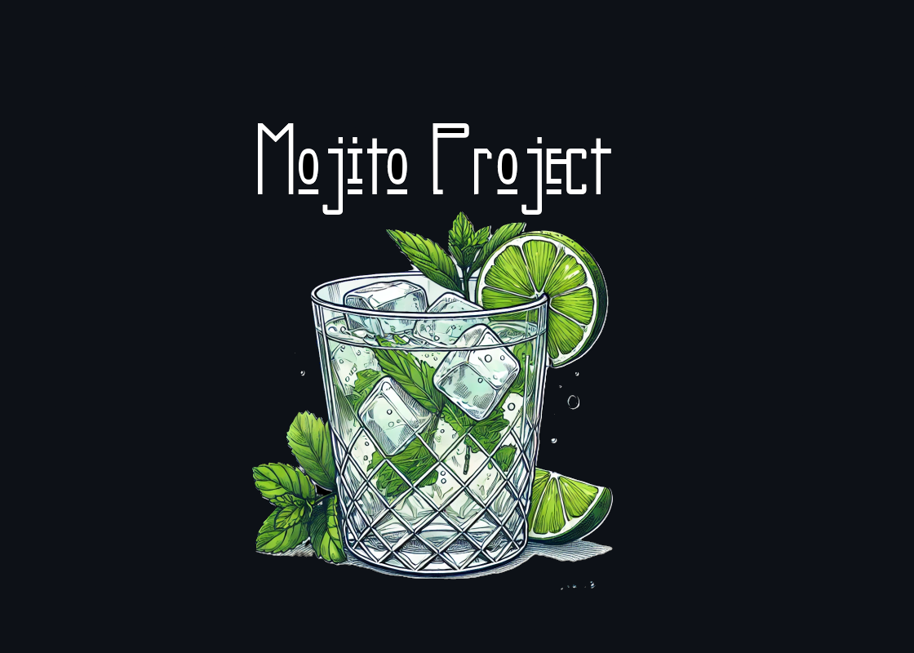

<br>
    </p>


<br><br>
# STILL UNDER DEVELOPMENT 
## No release and ISO or IMG file will be made before version 1.0. Using the code now may have bugs or incomplete pieces. 💿❌ If you want to install it without a iso file, go to "Setup and installation" section.
<br><br>

# About
Mojito is swiss army knife for ethical hacking (educational purposes only) and penetration testing, it runs on a raspberry pi 0 w/wh that use a wavseshare 1.44 inch lcd HAT display. It has a collection of hacking tools and it is based on Kali Linux. 
<br>

# REQUIREMENTS 📃
  - Wavseshare 1.44 inch lcd HAT display 
  - Raspberry pi 0 w/wh 
  - 16 GB sd card (You need much less, but you might need 16 GB for additional packages)
  - An external usb antenna that support packet injection and monitor mode. We recommend RTL8812BU or RTL8822BU Chipsets
  - An USB to Micro USB adapter
<br>

# SETUP AND INSTALLATION

## First version is not been released yet! 
### Before we continue: Mojito has only been tested on the Raspberry Pi Zero WH, but should work on all other Raspberry Pi.
1. Flash and setup Kali Linux for raspberry pi with <a href="https://www.raspberrypi.com/software/">Raspberry Pi Imager</a><br><br>
2. Change OS settings from Raspberry Pi Imager, it will ask you if you want to do it a few steps before flashing.<br><br>
4. Enable SSH, as username put "kali" and as password "kali" and put your SSID and WiFi password. Remember: if you do not connect to wifi and do not enable ssh you will not be able to proceed with the installation.<br><br>
5. Connect to USB port, and if you have it connect the antenna on the OTG port, Then wait... (The first boot is slow, don't worry it's normal!). Then, connect to it using ssh, for example:
```
ssh kali@192.168.1.214
```
You can see Mojito ip from your WiFi Router.
If it doesn't seem to appear, try connecting it to an HDMI and plugging a keyboard into it to try connecting to the wifi manually.<br>
# Now you can setup with Mojito Setup Helper! 
## Moggy will be happy to help you during the setup! 😸
### Clone and install Mojito!
```
 git clone https://github.com/rickyfili10/Mojito.git && cd Mojito/ && sudo python msh.py
```
### Follow and fill out his requests!
## Remember: This is not the first version of Mojito! You're using the "uncomplete" code of Mojito, it might not work and many function could not work as well
<!--# SIMBOLS LIST: 
   - NB! = No Battery Found! <br> 
   - Plug = pluged to a power source 🔌<br>
   - N% = battery level ( not tested ) 🔋<br>-->
# TO DO ✔️
  <br>
  ❌ Not implemented yet <br>
  ✔️ Implemented <br><br>

   - ✔️ Wifi deauth
   - ✔️ FakeAP
   - ✔️ Handshake capture
   - ✔️ Wps PIN bruteforce
   - ❌ Bluetooth Dos
   - ❌ Bluetooth Spam
   - ❌ Mojito official wiki
   - ❌ Plugin and app support
   - ❌ Other...

### Under BlacKat Custom Licence (BKL) 📄
  #### What you cannot do: ❌<br>
   - Use for non-commercial purposes 💸❌<br>
   - You cannot Create Derivative Works, and share them online 📄<br>
   - Impose additional restrictions 🟰<br>
  #### What you can do: ✔️<br> 
   - Share 🔗<br>
   - Use Mojito for educational purposes, 'obviously' :)
   - Use Mojito for penetration testing or ethical hacking ("with permission" READ TERMS AND USE OF THE SOFTWARE AND CHECK YOUR LOCAL LAWS BEFORE USING IT.)
### Read the license before using Mojito.
# DISCLAIMER ⚠️
### Mojito is for educational purposes only. 
The authors take NO responsibility and liability for how you use any of the tools/source code/any files provided. The authors and anyone affiliated with will not be liable for any losses and/or damages in connection or other type of damages with use of ANY Tools provided with Mojito. DO NOT use Mojito if you don't have the permission to do that. <br>
We, the authors and developers of Mojito, do not guarantee that the tools inside it will work completely bug-free and we do not guarantee the safety of being anonymous/undetected when performing an attack on a device or service.

## USE IT AT YOUR OWN RISK. 

Screen drivers based on https://github.com/Kudesnick/1.44inch-LCD-HAT-Code 💻<br>
Antenna drivers created by https://github.com/morrownr/88x2bu-20210702.git 📡<br>
⚠️ The rest of the credits will be implemented shortly ⚠️
## --- By BlacKat team. ツ ---
## Please follow us and drop a star! ⭐
